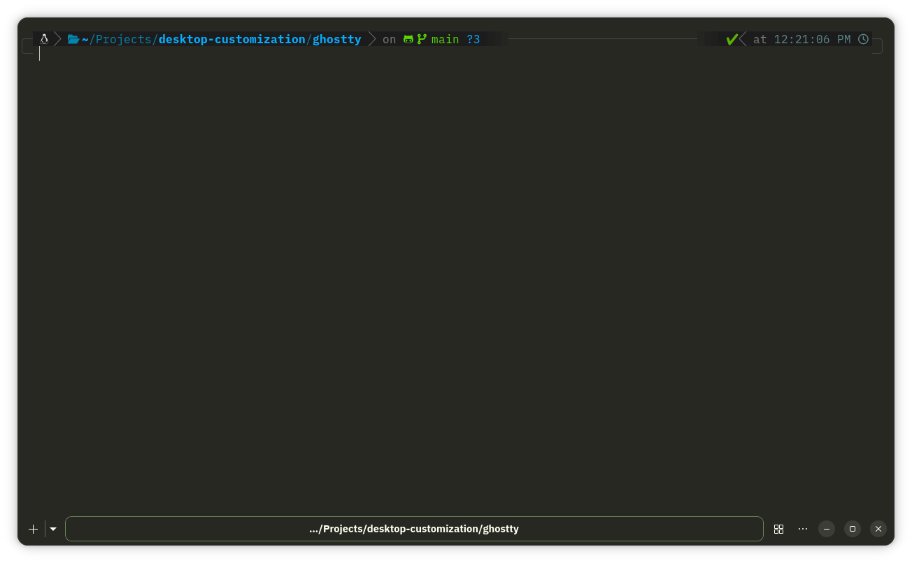
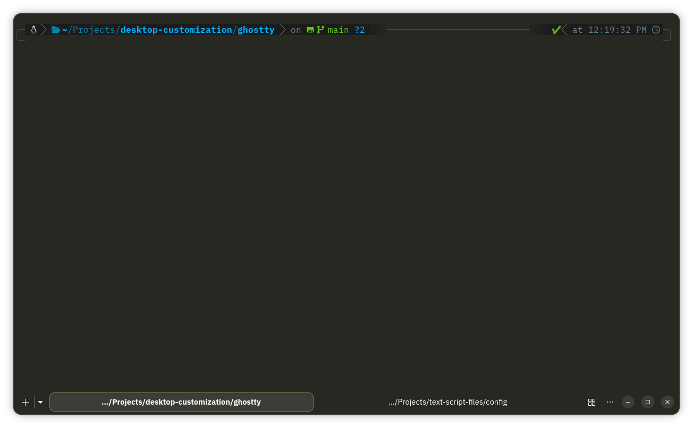

This is the config files for Ghostty terminal emulator. Ghostty already comes with sensible defaults, and this is some nicer additions, that may improve the productivity and aesthetics.

## How it Looks

When there is only one tab:

When there is more than one tab:

The config applies the "Monokai Classic" theme by default.

## How to use the theme

Download the `config.ghostty` and `custom.css` file. Paste them to the `~/.config/ghostty` folder of your system.

Restart Ghostty. That's it.

Create the directory if it is not present.
