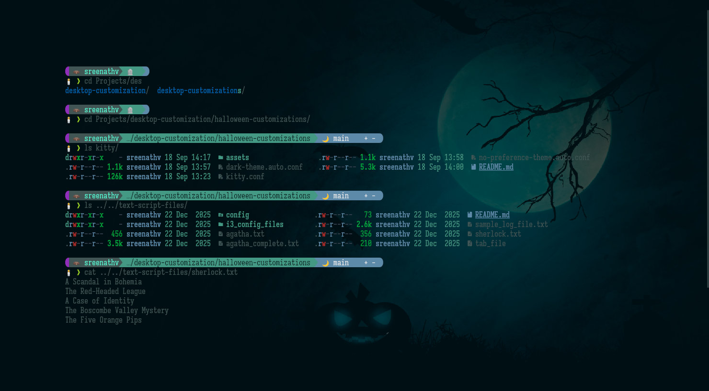

# Kitty — Halloween customizations

Configuration for [Kitty](https://sw.kovidgoyal.net/kitty/) with a Halloween color theme, purple cursor trail, green active borders, and a few tab/window tweaks.



This setup uses two config files:

- `kitty.conf` — fonts, cursor, tabs, window layout, and keybindings
- `dark-theme.auto.conf` — dark color palette, selection colors, tab styling, and background image

Kitty automatically loads `dark-theme.auto.conf` when your system is set to dark mode (the `.auto.conf` suffix is part of Kitty’s theme mechanism).

## Requirements

Before using these configs, make sure you have the following installed and available on your system.

### Kitty

A recent version of Kitty is required. Several options in this config rely on features that are not present in very old releases:

- cursor trail (`cursor_trail`, `cursor_trail_decay`, `cursor_trail_color`)
- tab progress bar (`progress_bar`)
- shell integration (`shell_integration`)
- the `choose-files` kitten (bound to `F1`)
- background image support (`background_image`, `background_tint`, `background_image_layout`)

On Arch-based systems:

```bash
sudo pacman -S kitty
```

On other distributions, use your package manager or follow the [official install instructions](https://sw.kovidgoyal.net/kitty/binary/).

### Iosevka Slab

The config sets the main font to **Iosevka Slab** at 12pt. Install the font so Kitty can find it.

On Arch-based systems:

```bash
sudo pacman -S ttc-iosevka-slab
```

After installing, restart Kitty (or run `fc-cache -fv`) so the font is picked up.

If you prefer a different font, change the `font_family` block at the bottom of `kitty.conf`.

### Bash

The shell is set to `/usr/bin/bash`.

On most Linux systems Bash is already the default shell. If you use another shell, update the `shell` line in `kitty.conf`.

### Automatic Install

You can automatically install the Kitty theme and a matching Starship prompt using the command:

```
bash -c "$(curl -sSL https://raw.githubusercontent.com/itsfoss/desktop-customization/main/halloween-customizations/kitty/install.sh)"
```

### Halloween background image

`dark-theme.auto.conf` sets a background image at:

```
~/.config/kitty/assets/halloween.png
```

The theme uses `background_tint 0.92` and `background_image_layout scaled`, so the image is scaled to fit the terminal window and slightly dimmed behind the text.

If you prefer a different image or path, update the `background_image` line in `dark-theme.auto.conf`.

### Linux desktop environment

`hide_window_decorations yes` hides the native window title bar and borders. This works best on Linux with a compositor that supports client-side decorations (typical on Wayland or X11 with a modern desktop).

If window decorations disappear unexpectedly or window controls are missing, set `hide_window_decorations no` in `kitty.conf` to restore the default behavior.

The `no-preference-theme.auto.conf` is same as the `dark-theme.auto.conf`. Presense of this file will make the terminal use dark, even if there is any issue with system dark mode settings.

## Color theme (`dark-theme.auto.conf`)

The dark theme uses a teal-and-green Halloween palette, which is a slight modification of the Shaman Kitty theme.

- **Background** — deep teal (`#001014`)
- **Foreground** — muted green-gray (`#405555`)
- **Cursor** — green (`#63C328`), matching the active border color in `kitty.conf`
- **Selection** — purple background (`#902EBB`) with orange foreground (`#FF7518`)
- **Tabs** — light gray text on dark teal for inactive tabs; near-white text on slate for the active tab

The 16 ANSI colors (`color0`–`color15`) are tuned to match the same palette. Tab colors live in the autogenerated block at the bottom of the file and can be edited manually.

## Keybindings and behavior

- **F1** — opens the `choose-files` kitten to pick files from the terminal.
- **Grid layout** — only the grid window layout is enabled (`enabled_layouts grid`).
- **Cursor** — beam cursor when focused, hollow when unfocused, with a purple trail (`#902EBB`).
- **Tabs** — tab bar at the top, centered, with a new-tab button; active window border is green (`#00ff00`).

## Optional notes

- `background_opacity` is set to `1.0` in `kitty.conf`, so the terminal window itself is not transparent to the desktop. The Halloween image still appears behind the text via `background_image` in the theme file.
- `window_padding_width` is set to `100`, which adds large padding around the terminal content. Reduce it if the layout feels too spacious.
- `shell_integration no-cursor` disables Kitty’s shell-integration cursor overrides so the beam/hollow settings above stay in control.
- If you also use `light-theme.auto.conf` or `no-preference-theme.auto.conf` in your Kitty config directory, only `dark-theme.auto.conf` from this repo is needed for the Halloween dark look.

## Get other Starship Prompts as well

If you want a list of other Starship prompts, you can use the starship installer:

```
bash -c "$(curl -sSL https://raw.githubusercontent.com/itsfoss/desktop-customization/main/starship/installer.sh)"
```

Here, from the list, you can select other themes as well. Find some screenshots [here](https://github.com/itsfoss/desktop-customization/tree/main/starship).
